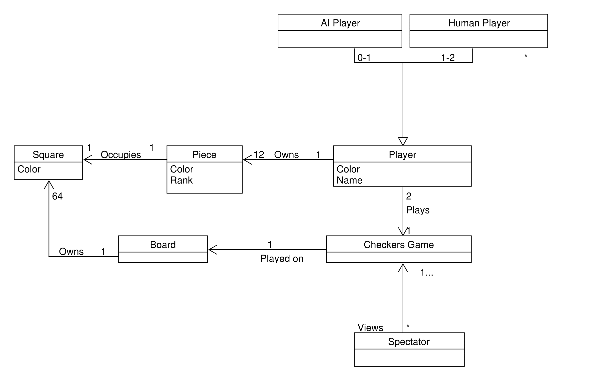
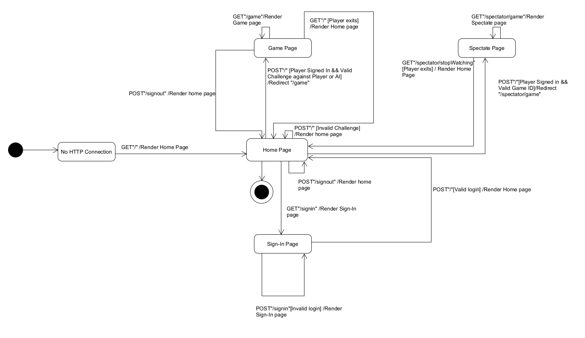
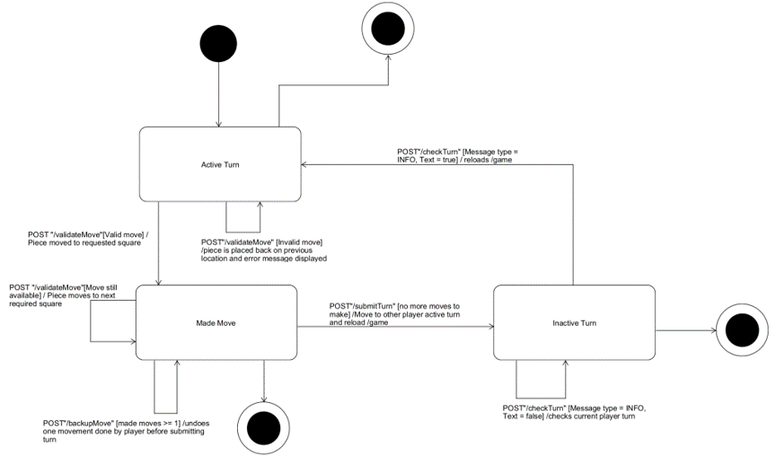
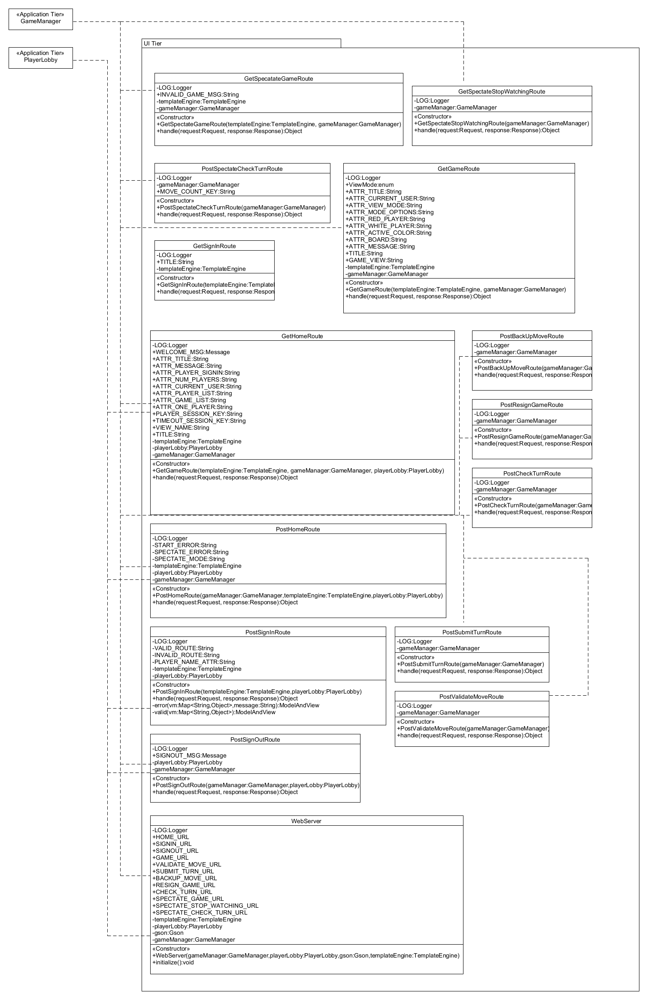
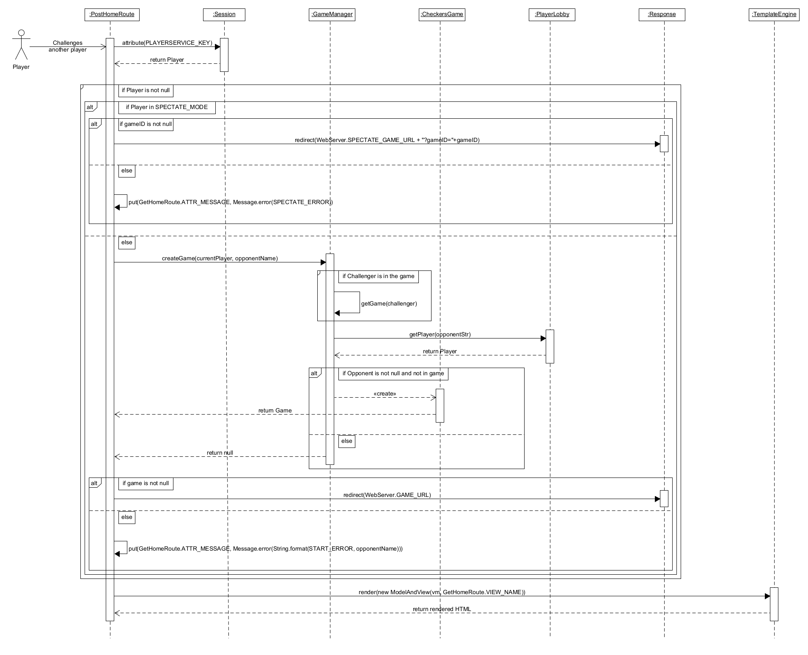
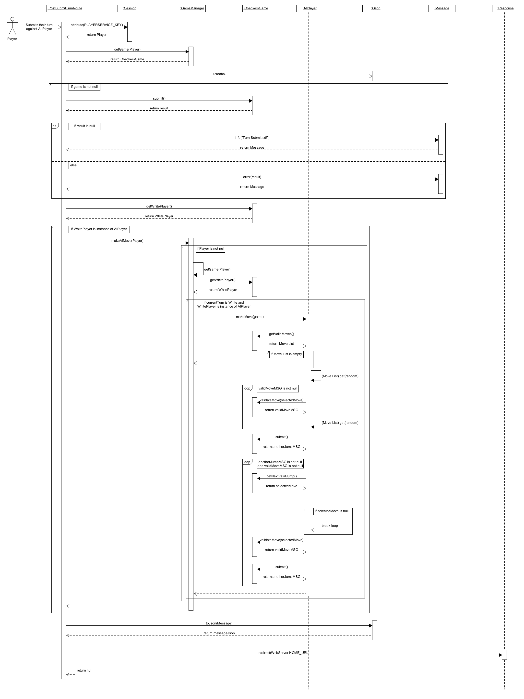
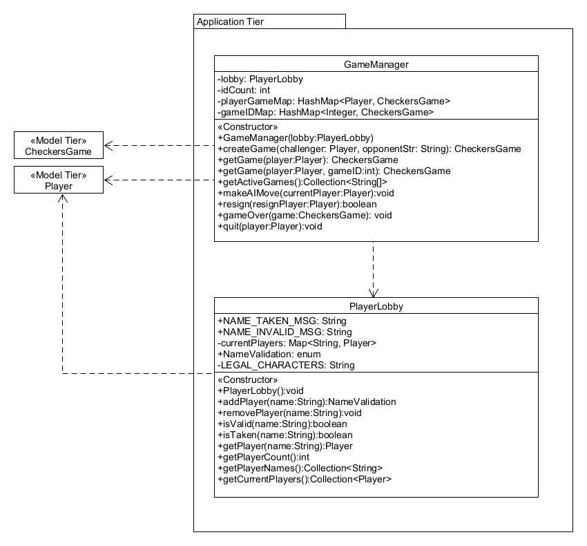
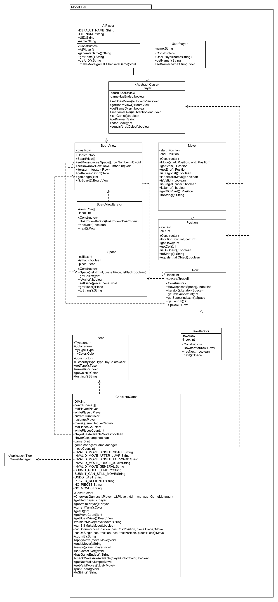
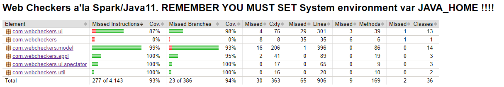
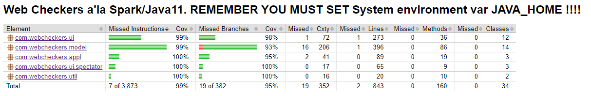

# **Opple WebCheckers Design Documentation**

## **Team Information**

* Team name: **Opple**
* Team members
  * Maksim Pikovskiy
  * Jack Milkovich
  * Matthew Heller
  * Will Hagele
  * Sean Clifford

### **Design Document Structure**

* [Executive Summary](#Executive-Summary)
* [Requirements](#Requirements)
* [Application Domain](#Application-Domain)
* [Architecture and Design](#Arch-and-Design)
* [Overview of User Interface](#UI)
* [Testing](#Testing)

---

## **Executive Summary** 

The web application of Web Checkers allows people to play checkers with each other. Once a player signs in to Web 
Checkers, they are allowed to challenge other signed-in players. Once a player challenges, the game interface allows for 
players to drag-and-drop pieces to make moves in order to win a game. Furthermore, the game allows one to play against 
an AI player and further allows one to spectate ongoing games.

### Purpose

Players can play against each other or an AI player in a game of checkers, trying to win.

### Glossary and Acronyms

| Term | Definition |
|------|------------|
| VO | Value Object |
| AI | Artificial Intelligence |
| QoL | Quality of Life |

---

## **Requirements** 

This section describes the features of the application.

### Definition of MVP

The Minimal Viable Product (MVP) of Web Checkers allows the players to sign in, choose a name, play a game
of Checkers using American rules against any available signed-in user, resign from a game they are currently in, and
sign out at any time.

### MVP Features

Players are able to choose any available (not in the game) player to play a game of American Checkers. In the game,
players can do simple moves (one space move), jump moves, multiple jump moves, and capture opponent's pieces that were
jumped over. Players' pieces can become Kings when they hit the opposite end row. Game ends when either player has no
pieces, no moves can be made, or one of the player resigns (which can be done at any time).

### Roadmap of Enhancements

AI Player: Players can challenge an AI Player at any time, as long as they are signed in and are not in the game.
This allows the players to practice.

Spectator: Users can choose to spectate ongoing games from the list of Ongoing Games. They cannot move any pieces and
can quit at any time to initiate their own games.

---

## **Application Domain** 

This section describes the application domain.

A Checkers Game is played on the Board, which consists of 64 Squares: either of Black or
White color. A Player can either be an AI Player or a Human Player. As the player, who
signs in with a chosen name, plays/starts the game, they are assigned a color. 1 Human
Player and 1 AI Player can play a Checkers game, or 2 Human Players can play one Checkers
game. As the game starts, each player will own 12 pieces of their assigned color, with
each piece occupying a Square. Furthermore, a spectator can join and view an ongoing
Checkers Game.

---

## **Architecture and Design** 

This section describes the application architecture.

### Summary

The following Tiers/Layers model shows a high-level view of the webapp's architecture.

As a web application, the user interacts with the system using a
browser.  The client-side of the UI is composed of HTML pages with
some minimal CSS for styling the page.  There is also some JavaScript
that has been provided to the team by the architect.

The server-side tiers include the UI Tier that is composed of UI Controllers and Views.
Controllers are built using the Spark framework and View are built using the FreeMarker framework.  
The Application and Model tiers are built using plain-old Java objects (POJOs).

Details of the components within these tiers are supplied below.

### Overview of User Interface 

This section describes the web interface flow; this is how the user views and interacts with the 
WebCheckers application.

The state chart for the application user interface starts at the no HTTP connection which signifies that no connection 
has been made to the localhost. Once connection has been established, the user is sent directly to the Home Page. From 
here the User can choose to sign-in, enter a game once signed in, or sign out. If the user chooses to sign-in to the 
checkers game, they will be redirected to another UI page that contains an area for sign-in. If the attempted username 
is invalid then the user is redirected back to the sign-in page for a valid username input. Once a valid name is given, 
the program redirects the UI to the home page. From here a signed in player can join a game, in which case they will be 
redirected to the game page UI. Or they can sign out which will redirect them to the home page with them completely 
signed-out. From the game page the user can play a game or chose to exit in which case they are redirected to the home 
page.

The state chart for the game state starts at *Active Turn* state which signifies that it is player's turn to make a move.
From here, player can make a move, which gets validated, or resign from the game. If the move is invalid, the game 
notifies the player and allows them to make another move. if the move is valid, the move gets put in the queue, ready to 
be submitted (*Made Move* state). In this state, if more moves are available, the game prompts the user to make that move, 
denying the player in submitting the moves (multiple jump moves). The user can also choose to back up a move if they 
desire to choose a different move. After all valid moves were made, the user submits those moves and player cannot make 
moves, meaning they are in *Inactive Turn* state. In here, the game periodically checks if the opponent made a move.
If they haven't, there is no state transition to an *Active Turn* for the player. If the opponent has made and submitted
a move, player's state transitions to *Active Turn*, which allows them to make a move again. From any game state, the 
player can choose to resign from the game.

### UI Tier

This diagram shows the class interaction between all the routes, and the Application Tier. Each of the classes
for the UI Tier are described below.

`GetHomeRoute`: it is a route handler that is used initially to start a session after no HTTP connection. From here one
can sign in to the `CheckersGame` and challenge other players.

`GetSignInRoute`: it is a route handler that is used when a player wants to sign in.

`PostSignInRoute`: it is a route handler that is used in name valid/taken/invalid logic. It stays on the sign-in page
if invalid or taken name is given. Furthermore, it redirects to the Home page if valid name was provided.

`PostSignOutRoute`: it is a route handler that is utilized when a user wants to sign out. After user presses *sign-out*
button, it redirects to the Home page with signed out condition (no user is signed in and the session cannot initiate
games).

`PostBackUpMoveRoute`: it is a route handler that allows a user player to back up a move. That is, it will, if possible,
undo the last move in the player's game and return a message that shows what move was undone.

`PostCheckTurnRoute`: it is a route handler that checks whose turn it is every 5 seconds. Once the opponent submits a
move, it will refresh the page for the current player.

`PostHomeRoute`: it is a route handler that redirects two players to a Game page if one player challenges another. For
this to happen, the challenged player must not be in the game and must be signed in. If the challenged player is in the
game, a message will be displayed to the challenger that the other player is in the game.

`GetGameRoute`: it is a route handler that is utilized to set two players (challenger and challenged player) boards to
view the Checkers game they are in. It is also responsible for viewing the game board from the correct perspective
(White Player vs Red Player perspectives).

`PostResignGame`: it is a route handler that resigns a player that pressed *Resign* button. If successful resign happens,
the resigning player will be sent back to the Home page.

`PostSubmitTurnRoute`: it is a route handler that checks if no more moves can be made and updates the UI board for both
players. It also updates whose turn it is.

`PostValidateMove`: it is a route handler that is utilized any time a player attempts to make a move, it checks if the
move is valid, invalid, moves can be made, etc. Message is displayed regarding move information.

`GetSpectateGameRoute`: it is a route handler that is utilized to rendering the board for the spectator requesting it.

`GetSpectateStopWatchingRoute`: it is a route handler that is called when the spectator wants to stop watching a game, 
so they need to be removed from the game and have their session cleaned up.

`PostSpectateCheckTurnRoute`: it is a route handler that is used when the spectator needs to check which player's turn 
it is in the game they are spectating.

The sequence diagram describes the project's behavior when a player challenges another player (Starting a Game). As the
player challenges another individual, the `PostHomeRoute` retrieves the user's `Player` object from the `Session`. If
`Player` is not null, the `PostHomeRoute` proceeds to check if the user wants to spectate a game. As the user wants to
challenge the player, it invalidates the check and proceeds to create a game. If the user is already in the game, it
gets the game and redirects them to that game. If not, the project retrieves the challenged player (opponent of user)
and checks if that opponent exists and is not in the game. If they are, it proceeds to give an error, stating that the
opponent is in the game. If not, the `PostHomeRoute` retrieves the newly created `CheckersGame`, game (which was created
`GameManager`), renders the Game Page through `TemplateEngine`, and the user now can play against their chosen opponent.

The sequence diagram describes the steps that the project goes through when a Player submits their turn when they are 
playing against AI Player. As the player challenges another individual, the `PostHomeRoute` retrieves the user's `Player` 
object from the `Session` and creates `Gson`. The `PostHomeRoute` then retrieves the game that the user is in. If the 
game is null, it redirects the Player to Home Page. If that game is not null, `PostHomeRoute` proceeds to submit the 
moves that Player has made. If there are no available moves, the project notifies that the *Turn Submitted*. Otherwise, 
it notifies the Player if there are available moves. Furthermore, `PostHomeRoute` checks whether the opponent is an AI 
Player or not. If it is not, the opponent of the Player gets to make a turn. If The opponent is an AI Player, 
`PostHomeRoute` calls on `GameManager` to make AI move. The `GameManager` checks whether the Player is not null, 
proceeds to get the current game it was called in, get the White Player (the AI Player), check that current turn is 
white and white player is `AIPlayer`. If both checks are right, `GameManager` makes `AIPlayer` to make a move. The 
`AIPlayer` gets the `CheckersGame` to get all valid moves and then randomly chooses a move from that list. `AIPlayer` 
makes `CheckersGame` validate the move until the selected move is a valid move. It further tries to submit a turn. If 
there are no jump moves, it submits the turns. Otherwise, it proceeds to call on `CheckersGame` to retrieve a valid next 
jump, validate that jump move, and submit it. It continues the process until there are no more moves it can make. The 
process returns to `PostHomeRoute`, which converts and returns Gson to Json with a result message of Player's moves.

### Application Tier

This diagram shows the class interaction between all the Application Tier classes, and the Model Tier. There is
interaction not only between tiers, but within the Application Tier itself, each of the classes
for the Application Tier are further described below.

`GameManager`: it is in charge of individual games. It can resign a player, get current game, create game, etc.
`GameManager` is also responsible for "notifying" `AIPlayer` when it is its turn to make a move. The constructor
for `GameManager` requires a `PlayerLobby` object, and the class controls game creation as well as shutdown.
The method `createGame` creates a `CheckersGame` from two players given, a `Player` challenger and String name
of the opponent name. The method `getGame` returns the `CheckersGame` of a given `Player`. In addition, another
`getGame` method returns the `CheckersGame` based off of a `Player` and `gameID`. There is a method for creating
a list of String arrays of the active games called `getActiveGames`. The method `makeAIMove` forces the `AIPlayer`
to make a move in a game session, and `resign` allows the `CheckersGame` to end when a player resigns. The method
`gameOver` starts clearing up a given `CheckersGame` after the end of the game is called. Lastly, `quit` allows
a `PlayerUser` to quit a `CheckersGame`.

`PlayerLobby`: it contains all players within current session. It is utilized in many classes such as `GameManager`
when creating games. The constructor for the `PlayerLobby` creates a new hashmap of the `currentPlayers`.
The method `addPlayer` takes a string `name` and if it is valid returns the valid state. The `removePlayer` method
removes a player based on the string `name` from the `currentPlayers` hashmap. The method `isValid` checks to see if
the given string `name` is a valid, legal name. The method `isTaken` returns a boolean of if the name given is
already in use. The method `getPlayer` retrieves the given string `name`. The method `getPlayerCount` gets the
amount of current active players, and `getPlayerNames` returns a collection of all names of current players.
The method `getCurrentPlayers` returns a collection of not the string names but the `Player` objects themselves.

### Model Tier

This diagram shows the class interaction between all the Model Tier classes, and the Application Tier. Classes within
the Model Tier not only interact with one another, but the Application Tier as well. These Model Tier
classes are described below.

`BoardView`: it utilizes `Iterator` and `Space` array of space objects for `setRow` as well as iterator which is
overridden and returns the `BoardViewIterator`. `BoardView` can flip the board across its x-axis where each row is
flipped using `getRow.flipRow`.

`CheckersGame`: it is the main driver/engine for the logic of Checkers Game. It creates the board for two players that
are starting a game, initializes the white and red players as well as ensures organization with `currentTurn`. This
`CheckersGame` class contains much of the logic for a checkers game, such as `validateMove`, `canStillMakeMove`(which
checks to see if a player can still make an additional move after a valid move) and `canDoJump`(which assists in
force jump, which means if there is a jump that can be made on a board it must be made). `canDoSingle` which checks to
see if a piece at a given location can perform a simple move of one diagonal in any direction (this helps with both
king and non-king pieces), submit which is when a player hits *Submit Turn* button, this method will take the
`moveQueue`, which is populated as the player creates moves with their piece, and checks the validity of each move in
the `moveQueue`. This method also changes current turn color if all aspects of the moves are valid. `CheckersGame` has
`applyMove`, which will enact moving a simple move on the board, `undoMove`, which will send the piece back one state
if the player has moved the piece to anywhere but its original position on the board, `resign` which handles a player
that clicks resign from game, `setGameOver` which sets the game over state on both red and white player, `hasGameEnded`
which checks to see if the game has ended, this includes, stalemate, pieces of one player completely gone, resign, or
someone signs out. Lastly, `checkMovesAreAvailable` returns if there is any piece that is able to move, if this is not
true then a stalemate occurs.

`CheckersGame` also helps `AIPlayer` make moves. `getNextValidJump` finds a next available and valid jump move in the
multiple jump move chain for an `AIPlayer` to make, while `getValidMoves` simply finds and sends all available and valid 
moves that `AIPlayer` can make.

`Move`: it is used whenever a move with a piece is made. The `Move` contains a start and end position, which is checked
for `isValid` using helper functions, `isSingleSpace` which checks that only one space was moved for simply move,
`isJump`, which checks if a jump is made in which the offset from start to end is 2 instead of one (0,0 -> 2,2), and
`getMidPoint` returns the position that is jumped, this can be used to ensure that the jump is valid by checking if an
opponents piece was located at middle location.

`Piece`: it is a class that contains all attributes for any given piece on the board, this includes king. `Piece` has
a color, a type which can be king or pawn, `makeKing` method that can be utilized, `getColor` of the piece.

`Player`: ***[Abstract]*** it is used by `UserPlayer` and `AIPlayer`. This class defines much of what a player can do
and contains the string name for a given player. You can `setBoardView` by giving the player a `BoardView` object, one
can `getBoardView` and `setBoardView`, `getGameOver` state, `setGameOver`,`isInGame`, and `getName`. There is an
important `hashcode` and `equals` method that differentiates each player object as well as any time one is used in a
`HashMap`.

`AIPLayer`: `AIPlayer` allows for `UserPlayer` to play alone without another `UserPlayer`. It is made by having a unique
identifier that specifies that `UserPlayer` wants to "Challenge AI Player". `AIPlayer` has a random display name for each
new session. It can make random moves that `CheckersGame` provides to it. Random moves can be single move, jump move, and
multiple jump move with both SINGLE and KING piece.

`PlayerUser`: it extends the ***[Abstract]*** `Player` class and emulates the real user for a checkers game.
You can obtain the name of a given `PlayerUser` using `getName` method that returns the String of the `PlayerUser` name.
In addition, setting the name of a given `PlayerUser` can be achieved by using the `setName` method. The `PlayerUser` 
constructor requires a String `name` in order to initialize the `PlayerUser` object.

`Position`: this class holds the data values for the `row` and `cell` of a given position on the board of a checkers game.
The `Position` constructor requires an integer `row` as well as an integer `cell` to be initialized. There is an `getRow`
method that allows for the return of the row value of the given `Position`. In addition, there is an `getCell` method
that returns the cell value of the given `Position`. There is also `isOnBoard` method that returns a boolean indicating
whether the `Position` is within the board parameters. There is a `toString` method that returns the row and cell in 
String format. A `equals` method that also exists that returns a boolean for whether a given `Object` is the same as the 
given `Position`.

`Row`: it is a class that utilizes `Iterator` class. The class represents a single row on a checkerboard. The `Row` 
constructor utilizes `Space` array of space objects as well as an integer `index`. There is a `iterator` method that 
returns a new `RowIterator` object based off of the given `Row` object. There is an `getIndex` method that returns the 
current `Row` index integer. There is a `getSpace` method that returns the `Row` `Space` object based off of the given 
`index`. In addition, `getLength` returns the `space` array length, and `flipRow` returns a flipped copy of the given 
`Row`.`RowIterator` class has a `hasNext` method that returns a boolean if there are more elements to iterator over in 
this `Row`. There is also a `next` method that returns the next `Space` element.

`Space`: it is a class that contains a constructor that requires a `cellIdx`, `Piece` object, and a boolean `isBlack`. 
The class represents a single space on a checkerboard. There is a method for getting the index of the `Space` object 
called `getCellIdx`. There is a method called `isValid` that returns a boolean for whether the `Space` is a valid 
designation of a move. A method `getPiece` exists for getting the piece that resides on the `Space` object. The method 
`setPiece` sets the given `Piece` object to the given `Space` object. A String method for returning the `cellIdx`, 
`isBlack`, and `Piece` object in String form exists as `toString`.

### Design Improvements

If the project were to continue, one of the first things to improve AI Player. Current AI Player is nothing but a
random move generator. To improve it, one can use heuristic-based negamax search (simplification of a MinMax algorithm, 
which finds the maximum heuristic during the turn) with alpha-beta pruning (utilized to preemptively prune off branches 
that we know won't be taken) to generate the best moves that AI Player. Some heuristics of such an AI difficulty would 
be: number of pieces on the board for player and AI, total number of pieces, how far are the pawns to the enemy side 
(for both players), winning and losing situation. With that in mind, a new route should also be introduced, which happens 
after one challenges an AI Player. This route will be used to select the difficulty of AI. Difficulties could include: 
easy (random moves), defensive AI (stops user player from making jumping moves), offensive AI(makes sure to take enemy 
pieces), and hard (the previously described AI Player).

Furthermore, the game board lacks basic information on pieces count for both players and time spent playing the game. 
Such changes are minor, but are part of quality of life (QoL) issues. In addition to that, Interactive Player Help 
could be added to the Web Checkers to allow players new to Checkers to understand how Checkers based on American rules 
work. Replay mode would be a great addition for players to review anything that went wrong in the game and what moves 
would have been better. With that in mind, there would be a history page of games that were played by the user. Saved 
replay games would require one to add authentication to store games based on users. This would also require the project 
to store and encrypt sensitive information like username and passwords. Such improvements are QoL changes, allowing 
users to have a better experience using our Web Checkers project.

Moreover, SessionWatchDog could be added, which adds information for occurring events for all sessions and also adds 
a timeout feature to the session. Such a feature will allow the server to log out users that are inactive, improving 
the performance of the server (if it were to roll out into the real world, instead of closed site). 

Lastly, one thing to improve regarding the Checkers' logic algorithm is validateMove. As it currently stands, it is hard 
to understand and is a complicated piece of code. While it works, it will be great to make it more readable and 
understandable so that future developers of this project could add new features or improve the existing algorithms. It 
is another QoL update, but focused on maintainability of the project.

After looking through the code metrics, a number of areas were found that could be improved. Starting with the 
complexity, the `CheckersGame` class had the highest Average Cyclomatic Complexity at 3.82 and Weighted Method 
Complexity of 84. This suggests that a number of the methods in within `CheckersGame` should be refactored into more 
smaller methods that could be reused more. Two of the methods with a high cognitive complexity were _validateMove()_ 
with 31 and _printBoard()_ with 17. _validateMove()_ also had the highest Essential Complexity of 12, Design complexity 
of 15, and Cyclomatic complexity of 18. This method should be completely reworked to simplify the control flow and 
split into a couple of smaller methods with more focused test that could be reused elsewhere. For _printBoard()_, no 
redesign is necessary as it is simply a helpful debugging tool to print out a text representation of the checkers board 
and could be removed if necessary. Also within `CheckersGame`, a few more methods have a high Essential Complexity. 
These include _hasGameEnded()_ with 6, _canDoJump()_ with 5, _canDoSingle()_ with 5, and _checkMovesAreAvailable()_ 
with 4. All of theses methods could be simplified by using a few more general methods that would come from refactoring 
_validateMove()_.

Besides the `CheckersGame` class, the `GetHomeRoute`, `PostCheckTurnRoute`, and `PostHomeRoute` classes also had a high 
Average Cyclomatic Complexity. `GetHomeRoute` had 3.5 and its _handle()_ method had a high Essential Complexity of 4. 
`PostCheckTurnRoute` also had a 3.5 for its average complexity however its _handle()_ method was within the cognitive 
complexity, essential complexity, design complexity, and cyclomatic complexity tolerance. Finally, the Average Cyclomatic 
Complexity for `PostHomeRoute` was 3 and its _handle()_ method had a high Essential Complexity of 5. For all of these 
routes, some of the code in the _handle()_ methods can be moved into helper methods which would significantly reduce the 
complexity and simplify the code.

There were also a few more methods that had an Essential Complexity of 4 which included `AIPlayer.makeMove()`, 
`PlayerLobby.isTaken()`, `Position.equals()`, `Message.equals()`, and `Player.equals()`. For the three equals methods, 
nothing should be done since they are already simple methods and there is no point in separating out some of the tests 
to another method that would only be used by equals(). For `AIPlayer.makeMove()` and `PlayerLobby.isTaken()` the 
Essential Complexity could be reduced by reworking the logic flow in the methods. 

Finally, looking at some of the other metrics, there are a few other a areas of the project that could be improved. 
Overall the main project was well documented, but most of the unit tests could be documented a little better. The 
`BoardViewTest` is missing all of its documentation and `RowTest` is missing the class documentation. Both of these are 
simple fixes that just take a little time to document. On a more general note, the ratio of lines of code to comments 
for most of the unit tests is significantly higher than their corresponding class being tested. This shows that the most 
of the tests could benefit from a little more documentation. Besides, a few documentation fixes, five of the unit tests 
suffer from Low cohesion. `CheckersGameTest`, `PlayerLobbyTest`, `UserPlayerTest`, and `MoveTest` have a 10 for lack of 
cohesion and `GameManagerTest` has an 8. These results were noticeably different from the rest of the results at around 
2.2. This is likely due to having to create a lot of other unrelated objects in order to test the unit. This could be 
fixed by coming up with more direct tests on the unit and maybe using mock objects instead. Another issue for a few 
classes was high coupling. `Player` had 36, `GameManager` had 33, `CheckersGame` had 32, `GetHomeRoute` has 31, and 
`WebServer` also has 31 for the coupling all of which is significantly higher than the average of 8.9. `GetHomeRoute` 
should be fixed by refactor the class and maybe move some of the logic to another class such as `PlayerLobby` or 
`GameManager`. For `CheckersGame`, the coupling could be reduced by further separating the UI and Model tiers through 
the use of the application tier. This would minimize the direct calls to `CheckersGame` from the UI, reducing the amount 
that the UI needs to know about the game but at the cost of a tightly coupled model and application tier. For 
`GameManager`, nothing should be done as it is a manager class for `CheckersGame` and should inherently know a lot about 
the class. Furthermore, by reducing the coupling of `CheckersGame` with the UI, the coupling between the two classes 
would have to increase. There is also no recommendation for the `Player` class as it is already a very simple class and 
is used to keep track of all the information concerning the signed in player and is used to determine program flow. 
Finally, nothing should be done to the `WebServer` since it is responsible for setting up all of the routes in the UI 
tier and providing them with the single instances of the `TemplateEngine`, `GameManager` and `PlayerLobby.`

---
## **Testing** 

This section provides information about the testing performed and the results of the testing.

### Acceptance Testing

As of right now, all user stories pass all of their acceptance criteria tests.

One of the issues found are testing the existence of a data file in the project. As the path variable to the data file 
was private, such a testing required us to modify the name of the file, test it, and revert the change. Such testing is 
extreme and would definitely not be recommended. Furthermore, another issue is testing if the file contents are empty.
Such testing would be even worse, as it can result in data loss. Both of these issues were encountered when testing AI
Player random name generation. The algorithm uses a data file from which it reads and picks a random name.

Other than those issues, there are no further concerns regarding testing user stories.

### Unit Testing and Code Coverage

The unit testing strategy was to test every single path that the program can take. All possible paths in the if-else 
blocks were thoroughly tested. As such, most lines of code were covered by our unit testing. The lines of code that 
were not tested were unreachable or not registered by the Jacoco report.

When writing unit testing, our team utilized Mockito to avoid influences from class-under-test's dependencies and JUnit 
for assertions if the output of algorithms is the same as we expect it to be. In algorithms utilizing Random function, 
the coverage targets were conditional blocks of code. Such an example is iterative block of code found in `AIPlayer`'s 
`makeMove` method. This method checks if the randomly-selected move is valid, and if it is not, it iterates over all 
found possible moves, and selects them randomly until the selected move is valid. By mocking `CheckersGame` class, we 
replaced the results of `validateMove` based on what we wanted to test(valid move or multiple jump move).

Furthermore, one of the anomalies found were Jacoco report not registering that `halt()` was tested or reached, despite 
being tested by us.

Ultimately, our code coverage is 93%, with UI tier being 87% coverage, Model tier being 99%, and Application Tier 
being 100%.

Excluding Application and Web Server classes results in our total code coverage being 99%, with UI tier being 
99% coverage, Model tier being 99%, and Application Tier being 100%.

